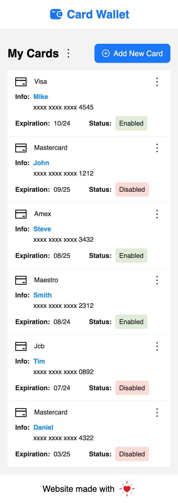

# React Simple Card Wallet

## Demo

Using demo app [Card Wallet](https://nhathq99.github.io/react-simple-card-wallet/)

## Screenshots

### Desktop

### Mobile

## Available Scripts

In the project directory, you can run:

### `npm install` or `yarn`

Run this command to fetch node packages using in this source

### `npm start` or `yarn start`

Runs the app in the development mode.\
Open [http://localhost:3000](http://localhost:3000) to view it in your browser.

The page will reload when you make changes.\
You may also see any lint errors in the console.